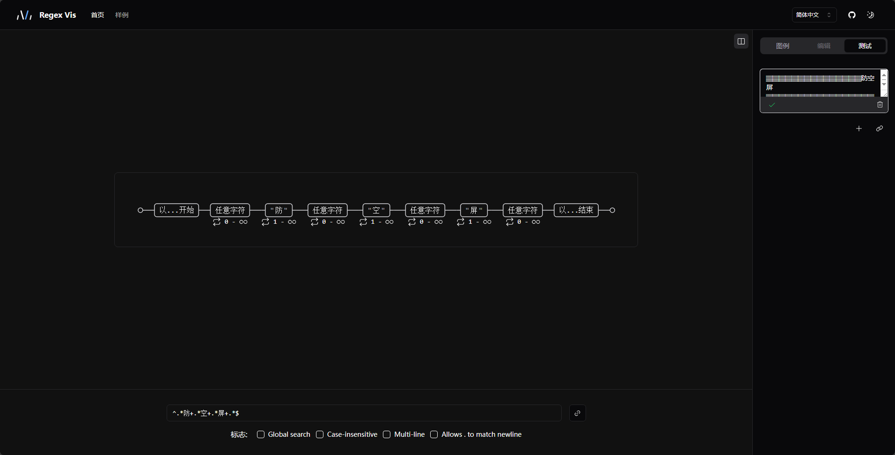
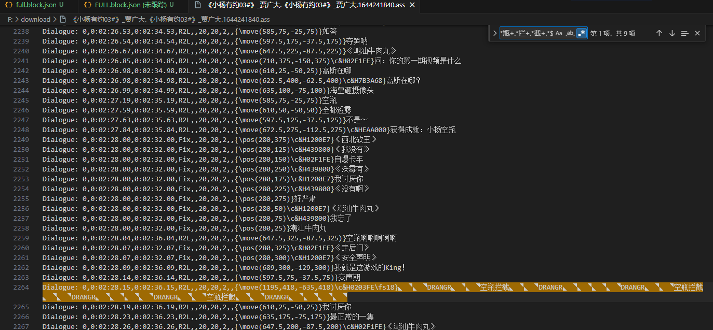
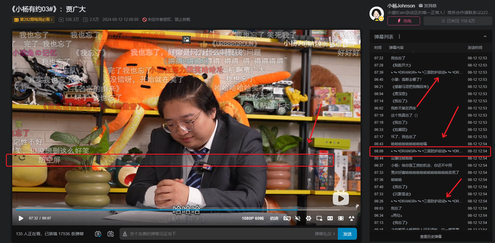
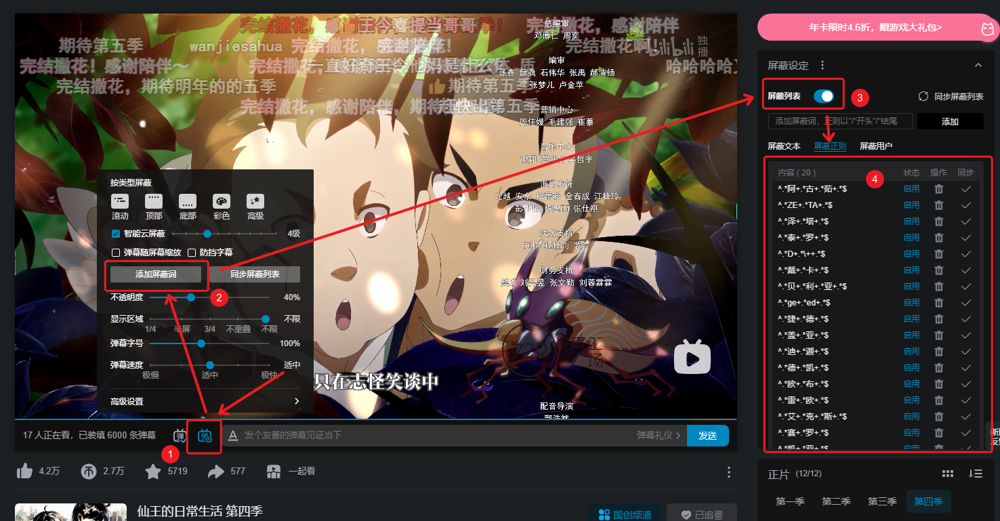
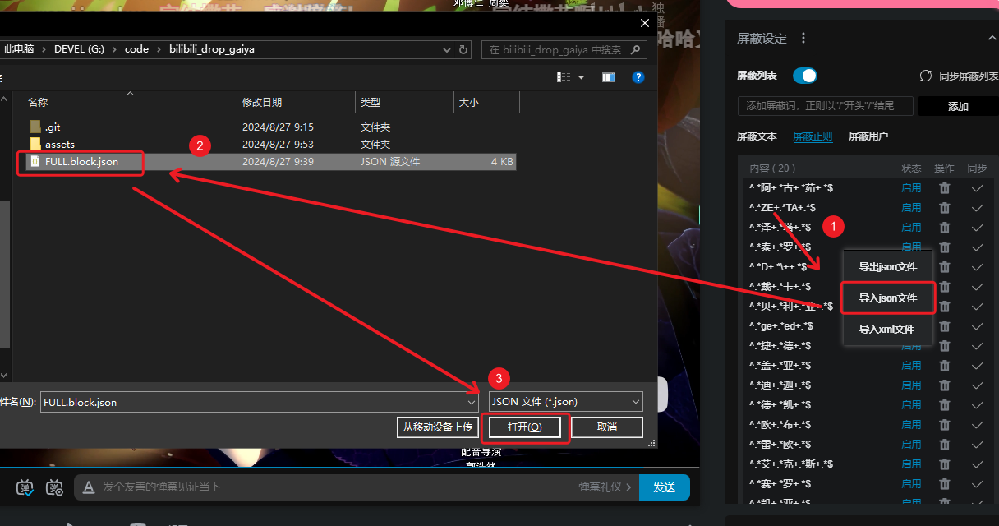
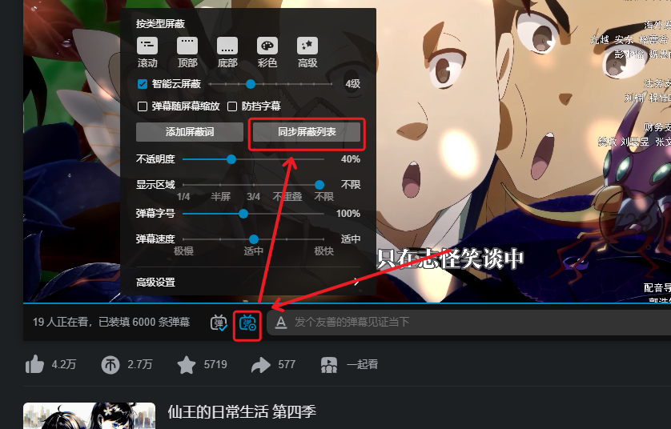
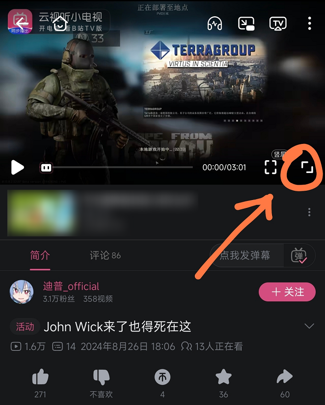
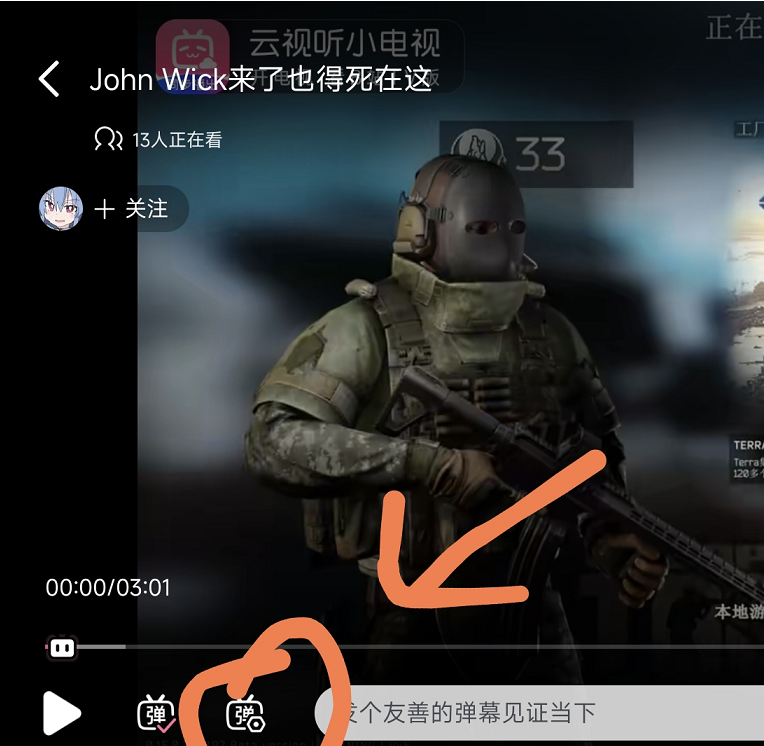
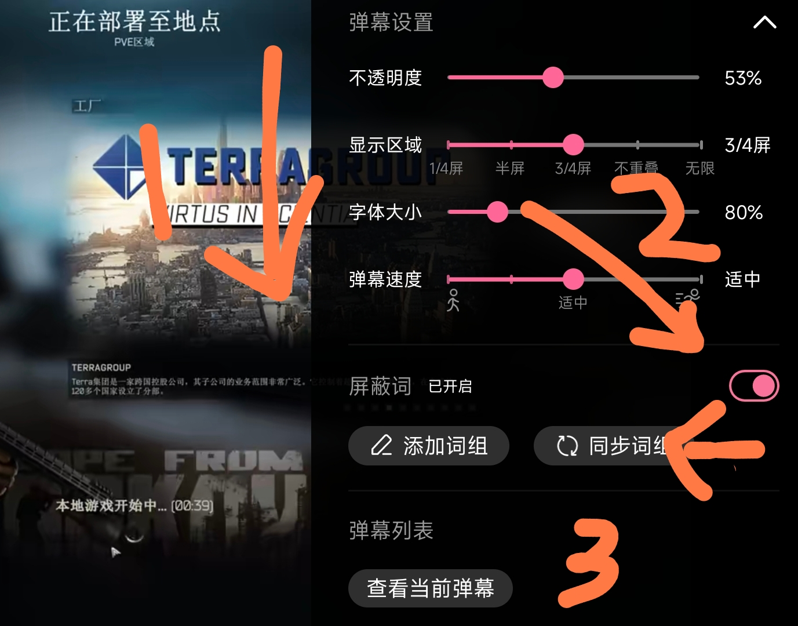

# bilibili_drop_gaiya

​	本人技术有限，git 的 merge 还在学习，也希望刷到该项目的朋友，多多包含。该仓库可随意创建分支和 merge 等操作，但希望不要带有恶意。该屏蔽列表会误伤，你可以下载后手动删除这部分内容。

## 简介

　　本仓库不包含代码，仅仅是使用正则表达式去处理。本人技术含量有限，会使用在线工具去验证刷屏的弹幕是否能得到匹配，使用到的工具如下：

- 在线正则编写工具 [regex-vis](https://regex-vis.com/) github 仓库：[Bowen7/regex-vis](https://github.com/Bowen7/regex-vis)

像这些 ~~若只~~ 是无穷无尽的，严重影响观看体验。举报只能清除单个，但还是会有很多类似弹幕出现。我看视频打开弹幕，不是为了看 ~~傻子~~ 刷屏的！

这帮 ~~初生~~ 真能刷啊！

所以，才有了这个仓库。

## 使用方法

### PC端导入

　　在 bilibili 任意视频中，都可以进行设置！

1. 点击 弹幕框左侧第一个带齿轮的弹幕图标；
2. 点击 添加屏蔽词；
3. 打开 屏蔽列表按钮（如果默认打开则无需这步）；
4. 找到下方列表，并右键列表；
5. 点击 导入 json 文件；
6. 找到下载下来的的 `*.block.json`；
7. 选中文件，点击 打开 后，完成导入全流程。

>  理论上,bilibili的弹幕导入不会重复或者是替换原有的屏蔽项，而是追加和覆盖重复，已经有的重复屏蔽项也不会新增，仅仅是追加没有的屏蔽项

### PC端同步

1. 点击 弹幕输入框左侧第一个带齿轮的弹幕图标；
2. 点击 同步屏蔽列表 后，完成同步操作。

### 手机端、平板HD端同步

>  **手机端只支持同步和手动添加，不支持 json 导入**，HD版操作与手机端操作一致。

</img></img>
</img>

1. 随便进入一个视频，然后进入全屏；
2. 点击 弹幕输入框左侧第一个带齿轮的弹幕图标；
3. 下拉右侧设置页面，找到屏蔽词；
4. 打开屏蔽词（默认打开则忽略）；
5. 点击 同步词组 后，完成同步操作。

## 叠甲？

　　对于一些屏蔽词，是我个人行为，完全主观。当然，庆祝的词我是不会屏蔽的，【完结撒花】等。若不喜欢，可以下载后可单独去掉。例如：

- **【可以呼吸】** 在一些恐怖场景或者是视频画面中憋气的桥段，会有弹幕出来说可以呼吸。我的评价是：“不是，我带入场景怎么了，可以呼吸用你教？”
- 【正常呼吸】 跟上面相同
- **【道具】【演】**在一些场景中，会有人张口就来，演不演心知肚明，但恶意评价视频出现的 up 也好、博主也好、视频拍摄者也好，礼貌吗？
- **【泪目】**是挺泪目的，但看多了泪目的弹幕会很烦。我代入感特别强，感人的桥段就是很感人，并不需要看到弹幕后才流泪。

该文档未完成，后续也会不间断更新。大家可以直接下载下来用

